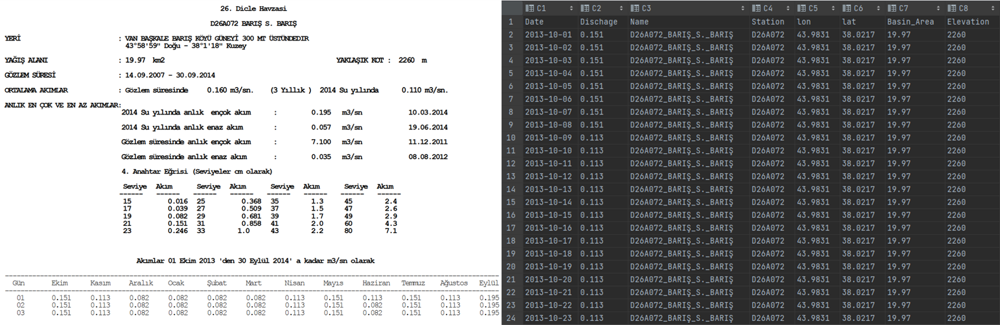

## DSI stream measurement book parser

PDF table parser of the measurements table DSI Akim [Gözlem Yıllıkları](https://www.dsi.gov.tr/Sayfa/Detay/744)


* file : PDF file to be parsed
* page : page of the table
* year : year of the measurement (water year)
* extract : extraction of the data in csv format

## Usage

```python
folder = '../data'
file = 'dsi_2014.pdf'
year = 2014
page = 558
extractpage(os.path.join(folder, file), page=page, year_=year, extract=True)
```



#### Dependency

pandas , pdfplumber
